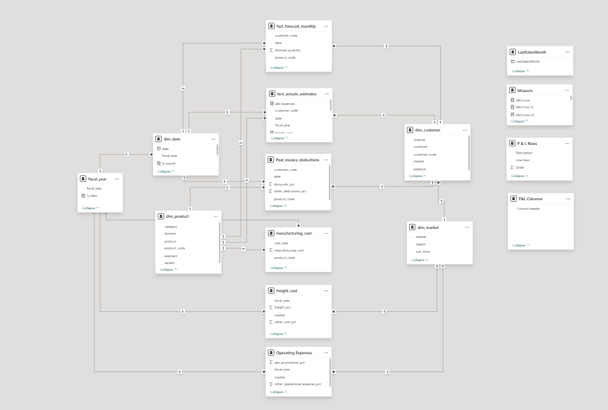
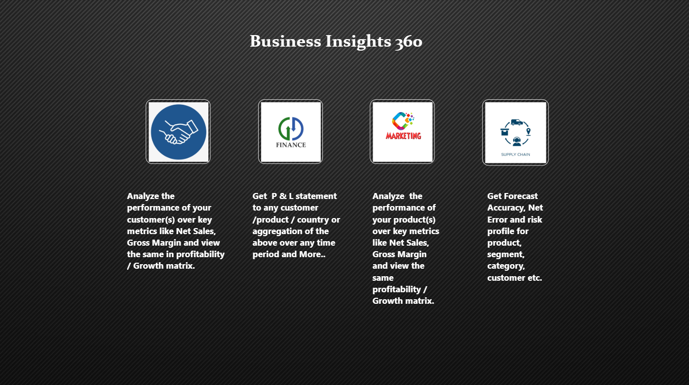
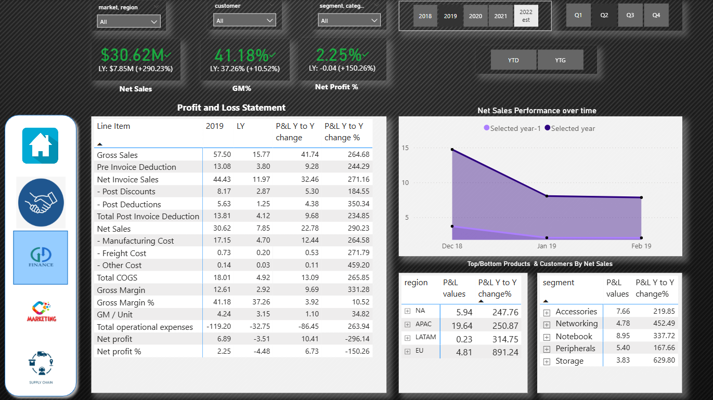
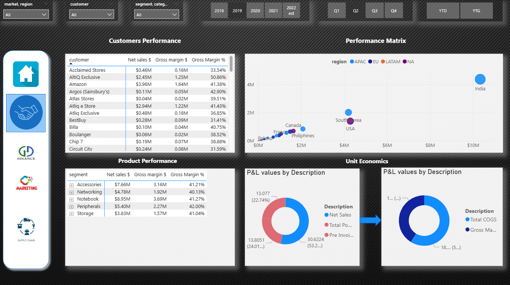
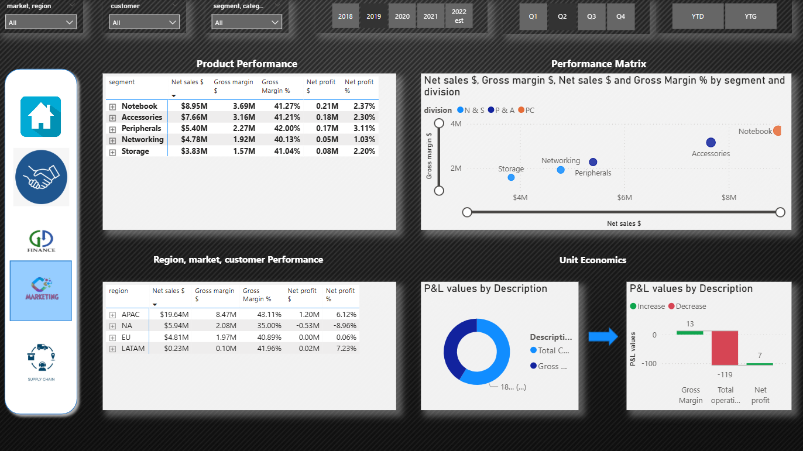
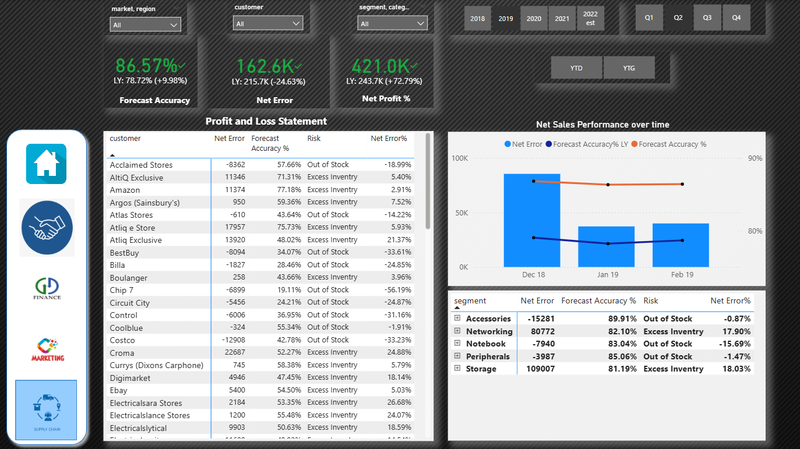

# 📊 Business 360 – Power BI Case Study  

An advanced **Power BI project** analyzing **AtliQ Hardware’s global sales and performance trends** across both brick-and-mortar and e-commerce markets.  
The objective was to build a unified, interactive business intelligence solution that enables leadership to make **data-driven, strategic decisions** backed by real-time insights.

---

## 🎯 Key Objectives  
- Integrate and model data from SQL and Excel sources into a centralized Power BI dashboard.  
- Deliver multi-department analytics across **Sales, Finance, Marketing, and Supply Chain**.  
- Build dynamic KPIs for tracking **profitability, revenue growth, and forecasting accuracy**.  
- Enable leadership to identify high-performing regions and product categories.  
- Reduce manual reporting by automating the ETL and visualization pipeline.  

---

## 🧩 Tools & Technologies Used  

| Tool | Purpose |
|------|----------|
| **Power BI Desktop** | Dashboard creation and interactive data exploration |
| **Power Query (M Language)** | Data cleaning, transformation, and preprocessing |
| **SQL Data Source** | Original structured dataset imported into Power BI |
| **Excel** | Used for additional financial data (operating expenses, costs) |
| **DAX (Data Analysis Expressions)** | Built KPIs and time-intelligence metrics |
| **Star Schema Modeling** | Ensured performance optimization and accurate filtering |

---

## ⚙️ Process Flow  

1. **Data Import:** Imported structured data from SQL and Excel into Power BI using Power Query.  
2. **Data Cleaning:** Standardized formats, removed inconsistencies, and handled nulls.  
3. **Model Design:** Created a **Star Schema** connecting fact and dimension tables for optimized relationships.  
4. **KPI Development:** Built key performance indicators like revenue growth, profit margin %, and YoY comparison.  
5. **Visualization:** Designed a multi-page dashboard with slicers, visuals, and metrics across functions.  
6. **Validation:** Cross-checked key numbers and filters to ensure consistency and accuracy.

---

## 🗺️ Data Model (Star Schema)  

The data model follows a **Star Schema** for fast query performance and clarity.  
It includes key dimension tables (`dim_customer`, `dim_product`, `dim_market`, `dim_date`) linked with multiple fact tables (`fact_sales_monthly`, `fact_forecast_monthly`, `fact_actual_estimates`).  

---

## 🧼 Power Query (M) Transformations  

- Imported multiple datasets from SQL exports and Excel.  
- Cleaned, merged, and standardized data to ensure consistency.  
- Removed unused columns and redundant steps for a lightweight model.  
- Applied transformations to create analytical columns (Region, Category, Segment).  
- Automated repetitive ETL operations to save significant time on data refresh.  

> ⚙️ **Note:** Source connections in Power Query are disabled in this version for portability.  
> The data model inside the `.pbix` file is fully functional for visualization and analysis.

---

## 📈 Key Insights & Results  

- **Sales Growth:** Achieved a **10% year-over-year growth** across global markets.  
- **Profit Margin:** Increased by **4%** through cost and discount optimization.  
- **Marketing ROI:** Identified **20% potential spend reduction** without impacting sales.  
- **Forecast Accuracy:** Reached **86.5% accuracy**, improving demand planning efficiency.  
- **Time Savings:** Automated data cleaning saved approximately **4 hours weekly** of manual work.  

---

## 🚀 Future Improvements  

- Establish a **live SQL database connection** for automatic data refresh.  
- Add **Role-Level Security (RLS)** to control access by department or region.  
- Integrate **forecasting and what-if analysis** for scenario planning.  
- Include **DAX Studio performance tuning** for efficiency optimization.  
- Publish a **live interactive dashboard** via Power BI Service once Pro access is enabled.  

---

## 📎 Project Files  

- Power BI report file (`.pbix`) – complete dashboard and data model.  
- SQL database file (`.sql`) – original data provided as source.  
- Power Query transformations – all cleaning and ETL steps performed in Power BI.  

🔗 [📥 Download Power BI Project (Google Drive)](https://drive.google.com/uc?export=download&id=1GYlwJxiEfM2DaFqO9cdjtdxP3EQYYzD4)

> ⚙️ **Note:** Source connections are disabled for portability. The internal data model is active for visualization and insight exploration.

---

## 📊 Dashboard Preview  

### 🏠 Overview Page  
  

### 💰 Finance View  
  

### 🤝 Customer Performance  
  

### 📦 Product Performance  
  

### 🔮 Forecast & Risk Analysis View  

---

## 👨‍💻 About Me  

I’m **Yash Hooda**, an aspiring **Data Analyst** passionate about transforming raw data into business insights that drive decision-making.  
I specialize in **Power BI, SQL, and Excel**, with a focus on building structured, performance-optimized dashboards and data models.  

💼 **Core Strengths:** Data Visualization • Power Query • Data Modeling • Analytical Storytelling  
📍 *Rohtak, Haryana, India*  
📧 **oneyash11@gmail.com**  

🔗 **[GitHub Profile](https://github.com/11Yash1)**  
🔗 **[LinkedIn (Coming Soon)](www.linkedin.com/in/yash-hooda-14b84b22a)**  

---

🧾 **Project Authenticity Note**  
This Power BI case study was independently built by me to demonstrate a complete Business Intelligence workflow — from data import and transformation to DAX modeling and dashboard design.  
All datasets, relationships, measures, and visuals were personally created, tested, and validated to reflect real-world analytical scenarios.  

The `.pbix` file included in this repository is provided solely for portfolio demonstration and transparency of work.

---

⭐ *If you found this project insightful, consider giving it a star and following my journey as I continue building data analytics projects that merge clarity, logic, and storytelling.*
